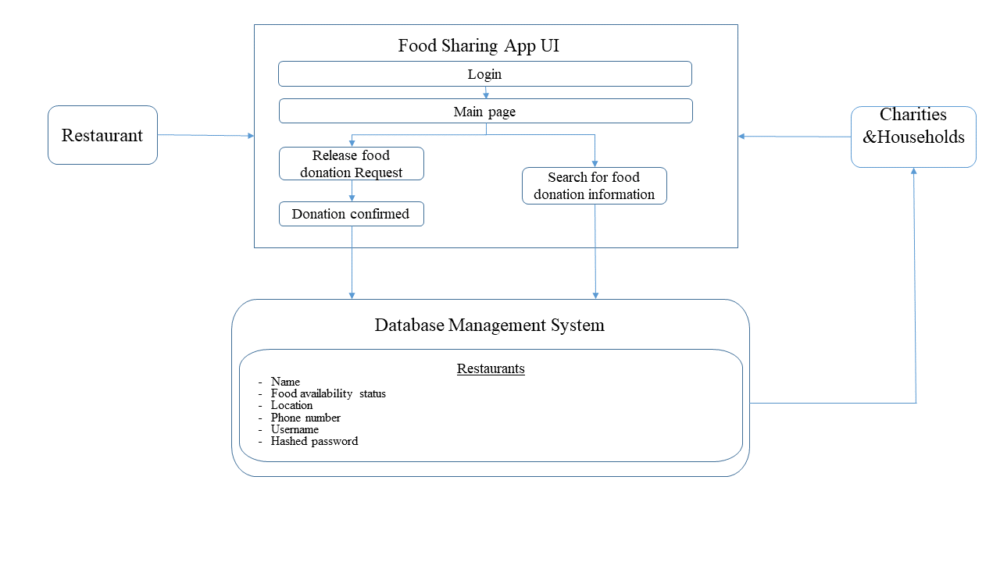
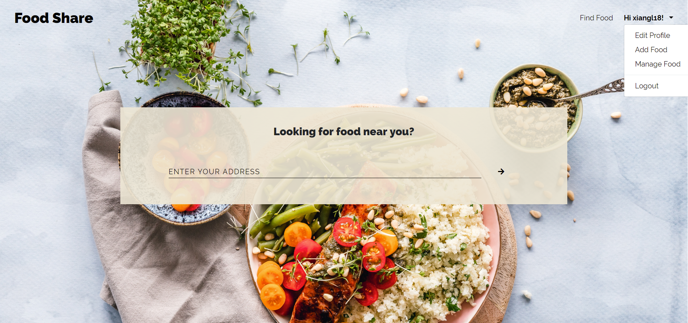
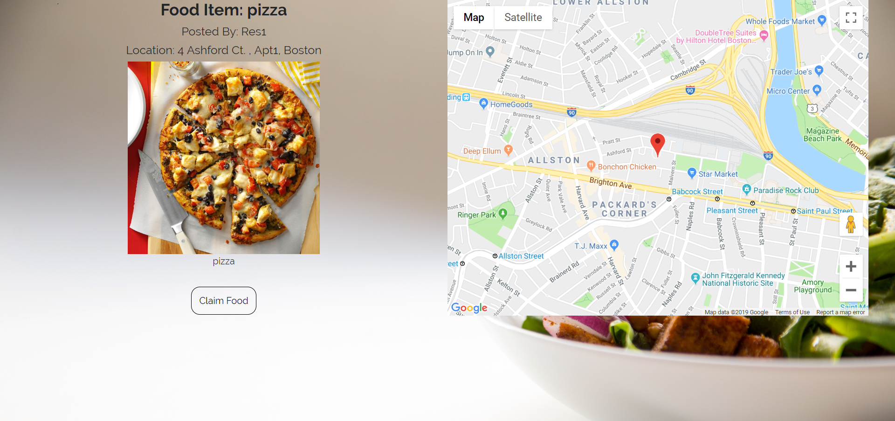
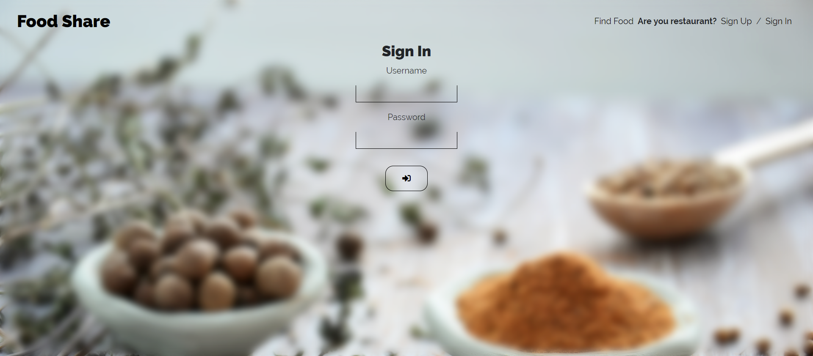
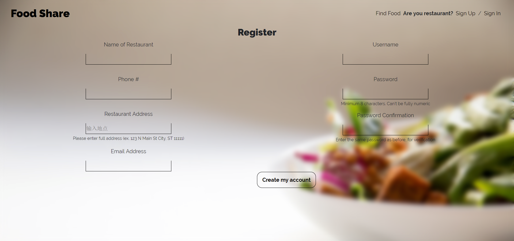
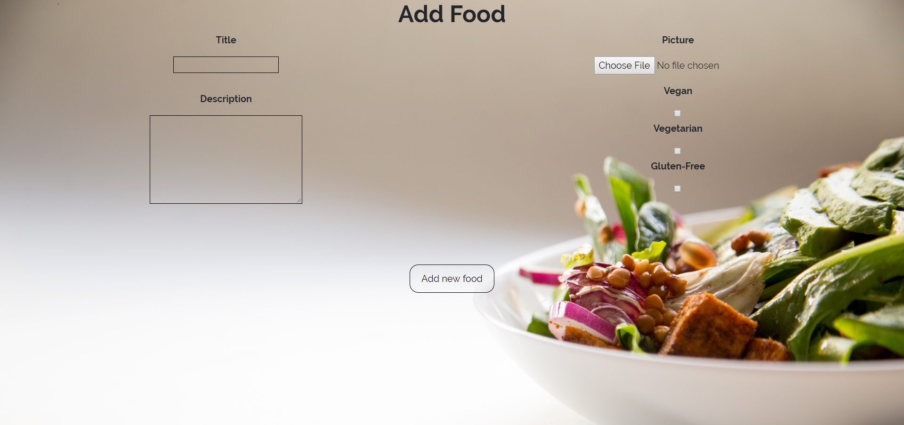

# Food sharing App
## Project Intro
Across the world, there are restaurants other food services that waste tons of excess food everyday. This web application is to establish a link between restaurants and the charity homes/needy households to enable the donation of excess food. 

## User Story
* As a restaurant owner - if I have excess food available for donation, I would log in to the web app and add the available food.
* As Charities/households - we will go onto the application, see restaurants on a map in our area with excess food available. And contact with the restaurants and get the food.

## Modular Architecture 

## Technologies to be used 
### Web Application
* MYSQL
  - We are currently using the default SPL database in django, for next step we will try to change the database to cloud database like AWS or Firebase.
* HTML/CSS
  - Styling the front end of our web application
* Django Backend
  - We both prefer to code in python since it is more intuitive and Django is one of the most documented backend frameworks for python so we decided to use that. 

## APIs
* Google Maps API & Street View Static API: For restaurants and charities to locate their positions.     
* Parse API: Store users data.

## Task assignments  
* learn database management and build our own relational or non-relational database for our backend.
* get familiar with UI design and try to build a user interface for our web app.

## Definition of First Sprint
For the first sprint, we wanted to research as much as we could about the different technologies and different architectures we could build. Our goal for the first sprint was to have a clear plan of what kind of application we are making, what technologies/APIs we wanted to use, and how to split up work for the future. For our second sprint, we want to implement our technologies and have a prototype working!  

## Sprint 2
For now we have built the initial main page for charities to search for restaurants around them, sign in and sign up page for restaurants. Considering that the users who are looking for food don't have to register in our website, we delete the users registration part in our website and backedn database.   

## Final   

### Main page

Charities can search the information about restaurents and foods offerd by input their address.  

Once you have search a place or you just go with the default location, the page will jump to the find food page.  
### Find Foods Around You  
In this page, you will find foods listed by restaurants, the left part is the food listed and some details about its categories.  Page is showed as followed.  

### Sign in page

  
For restaurants who are willing to offer foods they could firstly sign in.  

### Sign up page

  
Sign up page for restaurants.  

### Share Your Food And Post It  
After restaurants have signed in, they are allowed freely to add foods that they would like to share with others when they click the add food item. And when they are choosing food, they could upload image of food, and write description abot that, also they could  pick base categories for the food.  

  
### Manage Your Food Post 

