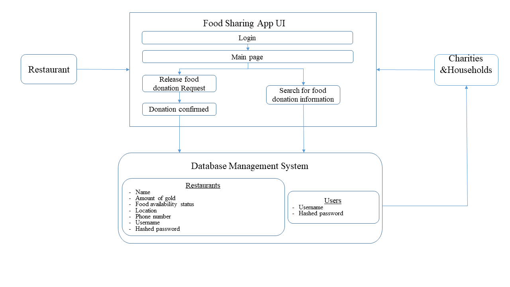

# Food sharing App
## Project Intro
Across the world, there are restaurants that waste tons of excess food everyday. This app is to establish a link between restaurants and the charity homes/needy households to enable excess food donation. There is also a 'goodwill' points system for restaurants to get rewarded for such a noble deed which they can use for their own marketing efforts by being a responsible social business as well.

## User Story
* As a restaurant owner - if I have excess food available for donation, I would log in to the app and indicate yes on it, then I can get “goodwill gold”. Also, it will help me with my own marketing efforts.
* As Charities/households - we will go onto the application, see restaurants on a map in our area with excess food available. And contact with the restaurants and get the food.

## Modular Architecture 

## Technologies to be used 
### Mobile Application
* MYSQL or MongoDB
  - We need some type of database for our program. Because the information that will be storing will realtively consistent for all of the restaurant and individual users, we could use a relational database. We're still deciding since a non-relational database gives us freedom to change the type of information we store if we decide later on in the developing process that things should change.
* Android Studio
  - We decided to make an Android Application since both of use have had previous exposure to Android Studio
  
### Web Application
* MYSQL or MongoDB
  - We still need a database regardless of the type of application we make, so our reasoning is the same as above.
* HTML/CSS
  - Styling the front end of our web application
* Django Backend
  - We both prefer to code in python since it is more intuitive and Django is one of the most documented backend frameworks for python so we decided to use that. 

## APIs
* Google Maps API & Street View Static API: For restaurants and charities to locate their positions.    
* Facebook API: Restaurant can share their dynamics to social networks when they get rewards food sharing.  
* Parse API: Store users data.

## Task assignments  
* learn database management and build our own relational or non-relational database for our backend.
* get familiar with UI design and try to build a user interface for our app(or learn web design and build a webpage).

## Definition of First Sprint
For the first sprint, we wanted to research as much as we could about the different technologies and different architectures we could build. Our goal for the first sprint was to have a clear plan of what kind of application we are making, what technologies/APIs we wanted to use, and how to split up work for the future. For our second sprint, we want to implement our technologies and have a prototype working!
